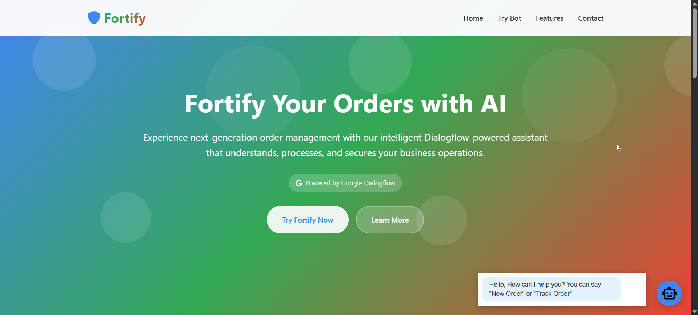
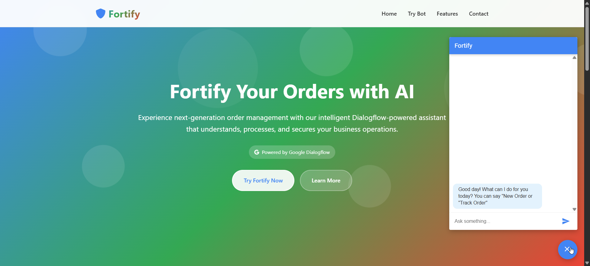
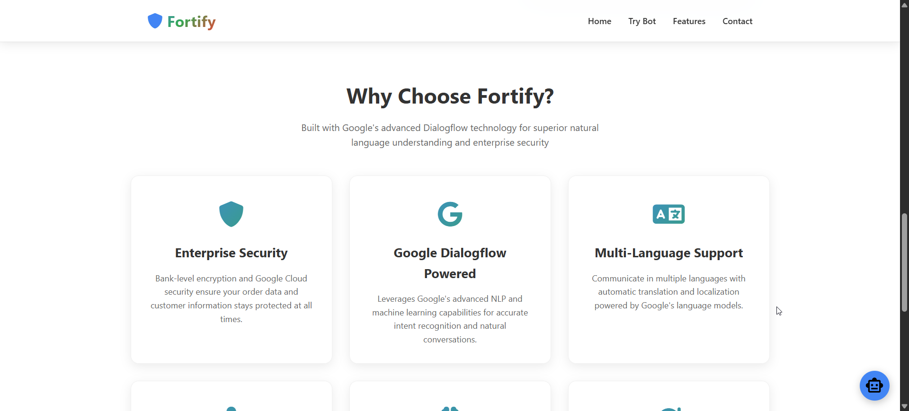

# NLP Chatbot for Restaurant Operations

**GitHub Repository**: [NLP_Chatbot-Dialog_flow](https://github.com/2005-PriyanshuSaini/NLP_Chatbot-Dialog_flow)

## 🧠 Overview

This project presents an intelligent chatbot designed to assist in managing restaurant operations. By leveraging natural language processing, it streamlines customer interactions, handles inquiries about the menu and services, and facilitates order processing, enhancing overall efficiency.

## 🚀 Features

- **Natural Language Understanding**: Processes customer queries related to menu items, orders, and restaurant services using NLP techniques.
- **Order Management**: Tracks orders, provides real-time updates, and ensures efficient communication between staff and customers.
- **Database Integration**: Utilizes MySQL to store and retrieve menu items, order details, and customer information.
- **Frontend Interface**: Developed a user-friendly interface using JavaScript for seamless customer interactions.
- **Backend Framework**: Implemented using Python's FastAPI for handling API requests and managing chatbot logic.

## 🛠️ Technologies Used

- **Backend**: Python (FastAPI)
- **Database**: MySQL
- **Frontend**: JavaScript, HTML, CSS
- **NLP Libraries**: spaCy, NLTK (as applicable)

## 📂 Project Structure

NLP_Chatbot-Dialog_flow/
├── main.py
├── db_helper.py
├── generic_helper.py
├── frontend
├── startup.txt
├── requirements.txt
├── README.md

## 📸 Screenshots

## 📄 License

This project is licensed under the MIT License. See the [LICENSE](LICENSE) file for details.